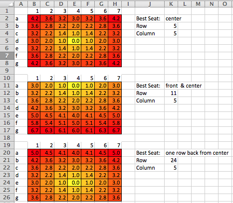

#README

## How To Run

### RESTfully

To run as a standalone application build the springboot jar and run it:

1. `mvn package`
1. `java -jar target/TicketReservation-1.0-SNAPSHOT.jar`

Now that the application is running there are a number of methods to interact with the service for the `main_event`

* get the eventid: `curl http://localhost:8080/event/list` (statically coded to `main_event`)
* see how many seats are available: `curl http://localhost:8080/event/main_event/seatsAvailable`
* hold some seats: `curl -d 'someone@mars.com' -H "Content-Type: application/json"  -X POST http://localhost:8080/event/main_event/hold/5`
  this returns a json payload and is much nicer to look at if you append `| jq ""` if you have `jq` installed.
To make it interesting, the seatHold duration is very short(currently set for 1 minute) to allow you to easily watch holds expire
and seats return to the available pool if you are looping or running the `seatsAvailable` query repeatedly.
* a full list of all holds can be retrieved using `curl http://localhost:8080/event/main-event/hold/listAll`
  (this is a play method for toying with the service and would not normally be exposed)
* the details for a single SeatHold retrieved using where the email address and the seatHoldId match earlier requests.
 `curl -d 'someone@mars.com' -H "Content-type: application/json" -X GET http://localhost:8080/event/main_event/hold/1`
* and finally confirm a SeatHold: `curl -d 'someone@mars.com' -H "Content-type: application/json" -X POST http://localhost:8080/event/main_event/hold/confirm/1` 
  

### Tests

This project consists of a simplified service implementation for a ticket service that
finds the best seats for a given group size from a venue of any size.  
The code to test the service is executed by issuing a `mvn test` which runs tests 
of the supporting classes and more importantly confirms that 
the **best** seats for a given group can be found.  **Best** is defined below.

## Architecture/Assumptions/Approach
**Best** in the implementation of `TicketService` has been defined as the closest 
and least number of blocks of contiguous seats from an ideal seat as defined during 
the creation of the `Event`.  An `Event` is created from a `Venue` which is defined 
as a collection of `SeatingFragments`  In this project a simple square venue is provided. 
Alternate constructs for venues could easily be created and passed in such as a small table 
layout as seen in a cinema & drafthouse, or perhaps a multi-level venue where a balcony is present.
These alternate layouts would be represented by implementing an appropriate calculation of cost
for all the seats.  By defining the venue independently from the `Event` we can imagine a venue 
where the ideal seat changes.  

During the creation of the `Event` from the `Venue` in the `SquareVenue` the implementation
of cost is the linear distance from the center of each seat to the ideal seat.

To pick the seat block during the creation of the seat hold the service finds
the least number of blocks that can be used(ideally 1) that have the lowest aggregate cost.
This is a nod towards the idea that a group attending a venue would want to be together even 
if the seats where generally worse than they would be if they were scattered around the ideal 
seating location.
  
For large values(larger than any remaining segment) of `numHold` seats, the largest blocks 
are used to accommodate the hold.  For smaller values of `numHold` closest single block
of seats that minimizes the cost of the block is selected.

## Persistence, locking, real world...

A number of simplifying assumptions have been made in the implementation that would be 
addressed in an environment where persistence exists, these simplifications include things
like the dao layer, locking layer, 

* the locking service is a simple abstraction in a real world this would use some 
sort of distributed consensus based approach for locking.
* The problem of reserving seats is NOT one where you can take an eventual consistency 
approach, for hopefully obvious reasons.  
* The Service calls as provided in the original interface did not account for 
providing any sort of eventService id, as such the TicketServiceImpl provided here 
is a simple model with an embedded eventService vs. some sort of EventDao helper.
* Scope of Responsibility for each class:
  * TicketService: Implements business logic around how to find best seats.
  * EventService: responsible for managing reservations, holds, providing complete list of available seats and 
    expiring old holds.
  * Venue: Defines how the seats are placed and calculates the **value** of each seat based
    on the distance from the idealSeat.  Used when creating an eventService to generate a collection of `SeatingFragments` 
    to subsequently divy out by the `Event`.
  * SeatHold: Represents both a hold and a confirmed reservation, contains seat, customer and time information
    related to an hold and the subsequent confirmed reservation.
  * Seat: a single seat with information that could be used to print on a ticket to describe location and 
    the cost value used in minimization efforts for finding **best**.
  * SeatingFragment: a block of contiguous seats supporting splitting, rejoining and aggregate seat cost queries

Next Steps: 

* I can imagine restructuring the relationship between the Venue and the EventService
for how seat cost is calculated, but would normally let it stand here as a 0.1 version
and hash that out during a conversation with my team mates.
* The EventService layer needs some more work, with maybe the addition of an Event bean
to make it cleaner.

## Development Notes

* Define Best, what a great word.
* This is not a normal bin-packing problem as the elements being packed can be fragmented.
* characterization of "high-demand", requires atomicity on reservations/holds, 
  single vm transactional approaches inadequate.  
* Because these are actual seats and individuals, the idea of eventual consistency is non-optimal, 
  to show this non-optimal concern a simplistic eventService wide lock during computation and holding
  of seating blocks was implemented.

### Data Structure Thoughts

* Number of seats in a row may not be constant.  This happens the moment the first seat
  is reserved and could also happen in a alternatively defined venues.
* Should empty seats take any space up in storage/data structure?
  * representation of structure and then fill it in with res/holds.
* we must address claim order the moment this architecture goes beyond 
  single node to determine order and also confirm that the first hold 
  that references a seat works and the second does not.  (two concurrent 
  users request a 'hold', only one can hold a given seat, the other has 
  to try again).
  
### Definition of `Best`

Best is a domain specific term, this could be calculated in numerous ways: 

* Distance from front/center of venue(small group musical concert)
* Distance from center of theater(simplistic movie model)
* Distance from center of the theater favoring the back half of the theater
(movie model accommodating for large screens are painful at close distance)
* in all cases best in these descriptions is about being closest to an 
  **idealized** seat.
* some more complicated/hand-tuned method based on some holistic stack ranking approach.

### Assumptions/Future Considerations

* Seating is linear, Non-linear seating(e.g. individual round tables like 
  they do at a cinema & draft house) are a future consideration.
* Balconies, additional levels also not considered

### Visualizations

The source for these is in xls spreadsheet in the `documentation_and_visualizations` directory

### Side Reading

In addition to intuition, I also read about the idea of using the minimal number of
blocks when packing the "bin" if you considered this to be a bin problem.  There were 
other approaches listed in this paper, such as filling bins up before moving on to other 
bins which would be relatively easy to implement with the `TicketService` containing this
strategy.

* https://hal.archives-ouvertes.fr/hal-00780434/document

